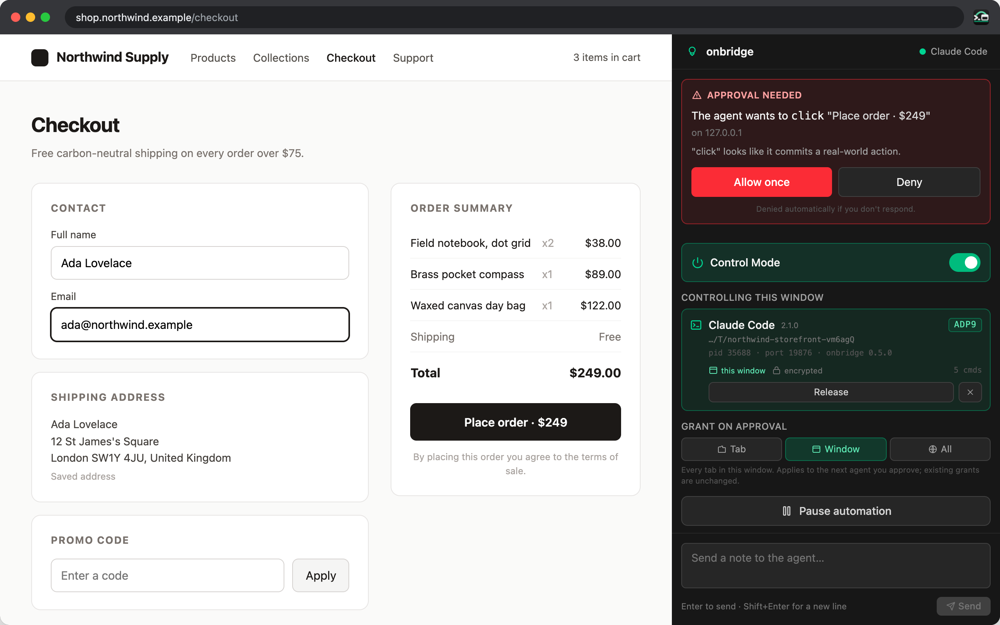

<p align="center">
  
</p>

<h1 align="center">OnBridge</h1>

<p align="center"><b>Let your AI agent use your real browser, with you in control.</b></p>

OnBridge connects AI agents such as Claude Code, Codex, Cursor and Gemini CLI to the Chrome you already use, over the [Model Context Protocol](https://modelcontextprotocol.io). Your agent can read pages, click, type, fill in forms and move between tabs, using your existing logins, while you watch every step from a side panel and approve anything that matters.

**Links:** [Chrome Web Store](https://chromewebstore.google.com/detail/onbridge/minhhfibhfnjdcgiipmcbfgclmeineca) | [npm](https://www.npmjs.com/package/@onllm-dev/onbridge-mcp) | [Documentation](docs/) | [Buy Me a Coffee](https://buymeacoffee.com/prakersh)

**Trust & Quality**

[](https://github.com/prakersh/onbridge/stargazers)
[](https://github.com/prakersh/onbridge/actions/workflows/ci.yml)
[](LICENSE)

**Compatibility & Docs**

[](https://github.com/prakersh/onbridge/releases)
[](https://www.npmjs.com/package/@onllm-dev/onbridge-mcp)
[](https://chromewebstore.google.com/detail/onbridge/minhhfibhfnjdcgiipmcbfgclmeineca)
[](https://nodejs.org)
[](https://chromewebstore.google.com/detail/onbridge/minhhfibhfnjdcgiipmcbfgclmeineca)
[](#quick-start)

**Zero telemetry. No OnBridge server. Everything stays on your machine.**

**Beta:** OnBridge is in active development. Features may change between releases.

[](https://star-history.com/#prakersh/onbridge&Date)



If OnBridge saves you time, consider giving it a star. It helps others discover the project.

> Powered by [onllm.dev](https://onllm.dev)

---

## Quick Start

You need **Google Chrome** and **[Node.js](https://nodejs.org) 20 or later**. Setup takes about two minutes.

### 1. Install the extension

Install **OnBridge** from the [Chrome Web Store](https://chromewebstore.google.com/detail/onbridge/minhhfibhfnjdcgiipmcbfgclmeineca), then pin it to your toolbar so it is always one click away.

### 2. Add OnBridge to your agent

Pick your agent below. Every option runs the same thing: the [`@onllm-dev/onbridge-mcp`](https://www.npmjs.com/package/@onllm-dev/onbridge-mcp) server, which `npx` downloads on first use. Nothing is installed globally.

<details open>
<summary><b>Claude Code</b></summary>

Run this in your project folder:

```bash
claude mcp add onbridge -- npx -y @onllm-dev/onbridge-mcp
```

This adds OnBridge to the current project only. To share the setup with your team through the repository, add `-s project`, which writes it to `.mcp.json`.
</details>

<details>
<summary><b>Codex</b></summary>

```bash
codex mcp add onbridge -- npx -y @onllm-dev/onbridge-mcp
```

Or add it to `~/.codex/config.toml` yourself:

```toml
[mcp_servers.onbridge]
command = "npx"
args = ["-y", "@onllm-dev/onbridge-mcp"]
```
</details>

<details>
<summary><b>Gemini CLI</b></summary>

Run this in your project folder:

```bash
gemini mcp add onbridge npx -y @onllm-dev/onbridge-mcp
```
</details>

<details>
<summary><b>Cursor</b></summary>

Add this to `.cursor/mcp.json` in your project, or to `~/.cursor/mcp.json` to use it everywhere:

```json
{
  "mcpServers": {
    "onbridge": {
      "command": "npx",
      "args": ["-y", "@onllm-dev/onbridge-mcp"]
    }
  }
}
```
</details>

<details>
<summary><b>VS Code (GitHub Copilot)</b></summary>

Add this to `.vscode/mcp.json` in your project. Note that VS Code uses `servers`, not `mcpServers`:

```json
{
  "servers": {
    "onbridge": {
      "type": "stdio",
      "command": "npx",
      "args": ["-y", "@onllm-dev/onbridge-mcp"]
    }
  }
}
```
</details>

<details>
<summary><b>Claude Desktop</b></summary>

Open **Settings → Developer → Edit Config** and add the `onbridge` entry below to `mcpServers`, then quit and reopen Claude Desktop. The file lives at `~/Library/Application Support/Claude/claude_desktop_config.json` on macOS and `%APPDATA%\Claude\claude_desktop_config.json` on Windows.

```json
{
  "mcpServers": {
    "onbridge": {
      "command": "npx",
      "args": ["-y", "@onllm-dev/onbridge-mcp"]
    }
  }
}
```
</details>

<details>
<summary><b>Any other MCP client</b></summary>

OnBridge is a standard stdio MCP server. Most clients accept this shape:

```json
{
  "mcpServers": {
    "onbridge": {
      "command": "npx",
      "args": ["-y", "@onllm-dev/onbridge-mcp"]
    }
  }
}
```
</details>

> There is nothing else to configure. The server accepts only the official OnBridge extension, so no other extension on your computer can connect to it.

### 3. Connect

1. Click the OnBridge icon in the toolbar to open the side panel, and turn on **Control Mode**.
2. Start your agent (restart it if it was already running) and ask it to use the browser:

   > *"Use OnBridge to open wikipedia.org and tell me today's featured article."*

   An agent connects to the browser only when it first needs it, so sessions that never use OnBridge stay out of your way.
3. The first time, the panel asks whether to let the agent connect. It shows the agent's name, project folder and a short **connection code**, and your agent shows the same code, so you know exactly which session is asking. Press **Allow and give control**: the agent can now use the window the panel is open in.

Later sessions connect without asking again. Each one waits in the panel until you press **Give this agent control**, so no agent acts in a window you did not give it.

---

## What OnBridge Does

- **Your browser, not a robot's.** No separate headless browser, no signing in again, no copying cookies around. The agent works where you are already signed in.
- **Real clicks and keystrokes.** Input goes through Chrome's own DevTools Protocol, so sites see genuine user events. Forms submit, drag-and-drop works, and rich editors respond.
- **You stay in control.** You decide which tab or window the agent may touch. Anything that spends money, deletes something or reads credentials waits for your approval, and no answer means no. Pause or disconnect at any moment.
- **Private by design.** Everything stays on your computer. The extension talks only to a program on your own machine over an encrypted connection. There is no OnBridge server and no telemetry.

### What you can ask

Once connected, just ask your agent in plain language:

- *"Open my GitHub notifications and summarise what needs my attention."*
- *"Compare the prices of these three products and put the cheapest in my cart. Don't check out."*
- *"Fill in this form with the details from `profile.md`, then stop so I can review it."*
- *"Reproduce the bug in issue #42 on localhost:3000 and tell me what the console says."*

---

## Everyday Use

**Choose what the agent can reach.** The **Grant on approval** setting decides how much **Allow and give control** and **Give this agent control** hand over:

| Grant | The agent can use |
|---|---|
| **Tab** | only the tab that was active when you granted it |
| **Window** | every tab in that window |
| **All** | the whole browser |

**Choose how often it asks.** Set in the side panel, and only there, so an agent can never loosen its own rules:

| Approval mode | The agent asks before |
|---|---|
| **Ask every step** | every navigation and every change |
| **Balanced** (default) | anything touching credentials, or with real-world consequences such as paying, deleting or sending |
| **Bypass** | nothing; it reverts to Balanced after 60 minutes and on browser restart |

**Keep it away from sites.** Allow or block domains from the panel. These lists apply in every mode, Bypass included.

**Know at a glance.** The toolbar icon is grey while Control Mode is off and turns green while it is on, so you can always see whether an agent could act.

**Watch and talk.** The side panel shows a live feed of every action. The agent can ask you questions there, and you can send it notes at any time. **Pause** stops everything instantly, and Control Mode turns itself off after 30 idle minutes.

**Run several agents.** Each agent gets its own grant, so one can work in one window while another works in a second. Grants cannot overlap. When several agents ask to connect at once, the panel lists each one with its connection code and its own Allow and Deny, so you choose which to let in.

**Use several browsers.** OnBridge works in more than one browser or Chrome profile at the same time, and each pairs on its own. An agent's request goes to every browser with Control Mode on; approving it in one withdraws it from the others, and **Accept new agents** invites it into another browser too. An agent works in whichever browser most recently gave it control, and the browser that had control is told, so two panels never both claim it.

> **Tip:** the browser can hold at most ten agents at once. An agent takes a slot the first time it uses OnBridge and keeps it until its session ends, so close sessions you have finished with.

---

## Who Is OnBridge For?

| Audience | Pain point | How OnBridge helps |
|---|---|---|
| **Developers using AI coding agents** (Claude Code, Codex, Cursor, Gemini CLI) | The agent can change code but cannot see the running app, the dashboard it deploys to, or anything behind a login | Drives your real browser, with your sessions, and reads console output and network requests while it reproduces a bug |
| **Frontend and QA engineers** | Flows behind sign-in, feature flags and real data are painful to script headlessly | Works in the browser you are already signed in to, with real input that forms, editors and drag-and-drop accept |
| **Anyone automating web chores** | Headless tools get logged out, and synthetic clicks are ignored by modern sites | Uses your existing logins and sends genuine input, while anything that spends, deletes or sends waits for you |
| **Security-minded users** | Handing an agent a signed-in browser feels like handing over the keys | Nothing is reachable until you grant a tab or window, approvals fail closed, domain lists always apply, and the channel is local and encrypted |
| **People running several agents** | Two agents in one browser fight over tabs, and it is unclear which session is asking | Each agent gets its own window, every request shows a connection code, and several browsers or profiles work side by side |

---

## FAQ

### How do I let Claude Code control my browser?

Install the [extension](https://chromewebstore.google.com/detail/onbridge/minhhfibhfnjdcgiipmcbfgclmeineca), run `claude mcp add onbridge -- npx -y @onllm-dev/onbridge-mcp` in your project, turn on Control Mode in the side panel, and ask Claude Code to use the browser. Approve the request that shows its connection code. See [Quick Start](#quick-start).

### Does OnBridge work with Codex, Cursor, Gemini CLI or VS Code?

Yes. OnBridge is a standard MCP server, so any MCP client can use it. [Quick Start](#quick-start) has ready-to-paste setup for Claude Code, Codex, Gemini CLI, Cursor, VS Code and Claude Desktop, plus a generic configuration for anything else.

### How is OnBridge different from a headless browser automation tool?

It uses the browser you already have open, with your logins, cookies and extensions, instead of a separate automated one. Clicks and keystrokes go through Chrome's own input pipeline, so sites treat them as real. And you stay in the loop: you choose what the agent can reach, watch every action in the side panel, and approve anything consequential.

### Is it safe to let an AI agent use my real browser?

OnBridge is built around that question. An agent controls nothing until you grant it a tab, a window or the browser. Anything that pays, deletes, sends or reads credentials waits for your approval, and no answer means no. Domain allow and block lists apply in every mode. Page content is marked as untrusted, so a malicious page cannot quietly instruct the agent. [How OnBridge keeps you in control](docs/security.md) has the details, including what it does not protect against.

### Does OnBridge send my data anywhere?

No. There is no OnBridge server and no telemetry. The extension talks only to the MCP server your agent started on your own computer, over an encrypted loopback connection. Your agent may send what it reads to its AI provider, under that provider's policy. See the [privacy policy](PRIVACY.md).

### Can I run several agents, or use several browsers?

Yes. Each agent gets its own grant, so two agents can work in two windows without colliding. OnBridge also works in several browsers or Chrome profiles at once; an agent works in whichever one most recently gave it control.

### Why does the panel show a code?

Every agent session has a short connection code, shown on its request and card in the panel and in the agent's own messages. Matching the two tells you which session is asking, even when two run in the same project.

### What happens if I do not answer an approval?

It is denied. Approvals fail closed, so walking away never lets an action through.

### Which browsers are supported?

OnBridge is built and tested for Google Chrome, installed from the Chrome Web Store.

### Is OnBridge free?

Yes. OnBridge is free and open source under the GPL-3.0.

---

## Privacy and Security

- **Nothing leaves your computer because of OnBridge.** The extension talks only to the server your agent started, over `127.0.0.1`. Your agent may send what it reads to its AI provider, under that provider's policy — see the [privacy policy](PRIVACY.md).
- **Web pages cannot reach the bridge.** Connections are checked by origin and encrypted end to end, and the pairing secret never passes over the wire.
- **Page content is marked as untrusted,** so a malicious page telling the agent to "ignore previous instructions" arrives clearly labelled as page text, and anything risky it asks for still needs your approval.
- **Passwords never enter what the agent reads,** and cookie values are only released if you approve it.

The full design, including what it does *not* protect against, is in [How OnBridge keeps you in control](docs/security.md).

---

## Troubleshooting

Start by asking the agent to run `bridge_status`, which reports the state of the connection.

- **Agents never appear after loading the extension from a Release zip or another build.** That extension has a different id, and the server accepts only the official one. Your agent's MCP log says `rejected connection from disallowed origin`. Set `ONBRIDGE_EXTENSION_ID` to the id shown at `chrome://extensions/` in your agent's configuration, then restart the agent. See **Installing the extension from source** under [Configuration](#configuration).
- **The panel shows `already paired with a different extension; refusing "…"`.** This only happens with `ONBRIDGE_ALLOW_ANY_EXTENSION=1`, the development mode that pins the first extension to pair. Delete the whole `~/.onbridge/peers.json`, then turn Control Mode off and on in the panel and approve the agent. Remove the whole file, not just one entry: any entry left behind keeps the old pin. If you did *not* just switch extensions, do not clear the file — this is also exactly what an unknown extension trying to pair looks like.
- **A new agent never appears.** Agents are only offered for pairing for 60 seconds after Control Mode is turned on, so that nothing can ask for access while you are not looking. The panel shows **A new agent tried to connect**; press **Accept new agents for 60s**.
- **The agent is connected but every command is refused.** It holds no grant yet. Press **Give this agent control** in the window you want it to drive.
- **The panel shows Reduced fidelity.** The debugger could not attach, usually because DevTools is open on the tab, and clicks are being simulated instead of sent as real input. Close DevTools and reload.
- **No new agent can connect at all.** Ten agent sessions that have used OnBridge are still open and hold every slot. Close the ones you have finished with.
- **The agent says OnBridge tools are missing.** Check that `node --version` prints 20 or later, then restart the agent so it starts the server again.

Still stuck? [Open an issue](https://github.com/prakersh/onbridge/issues) and include the `bridge_status` output.

---

## Architecture

```
Agent  ──stdio/MCP──>  MCP server
                            │
                   ws://127.0.0.1:9876
                   Origin-restricted · ECDH + AES-256-GCM
                            │
                     Extension background
                       ├── CDP (trusted input, console, screenshots)
                       └── Content scripts (DOM capture, all frames)
```

Your agent starts the MCP server, which stays out of the browser's sight until the agent first uses OnBridge. It then listens on a loopback port; the extension, which looks every few seconds while Control Mode is on, finds it, and they pair once with your approval. Every command then travels encrypted to the extension, which checks it against your grants, approval mode and domain lists before it touches the page.

| Package | Role |
|---|---|
| `packages/mcp-server` | The MCP server your agent starts (stdio). Opens an encrypted WebSocket on a loopback port the first time the agent uses a tool. |
| `packages/extension` | The Chrome extension (Manifest V3). Finds agents, pairs with them, enforces grants, approvals and domain lists, and acts on the page through Chrome's DevTools protocol and content scripts. |
| `packages/shared` | Protocol types, the handshake and crypto, and the snapshot format both sides use. |

Key properties:

- **Local only.** The server binds `127.0.0.1` and accepts only the official extension's origin; web pages are refused.
- **Paired, then encrypted.** A one-time pairing per browser derives a secret that never crosses the wire; every connection then uses a fresh ECDH key exchange and AES-256-GCM.
- **The extension is the trust boundary.** Grants, approvals and domain lists are enforced in the extension, not the server.
- **Connect on first use.** An agent session appears in the browser only when it first uses OnBridge, so idle sessions stay out of the way.

---

## Tools

40 tools, grouped by what they do. [docs/tools.md](docs/tools.md) lists them all with the behaviour worth knowing.

| Group | Examples |
|---|---|
| Observe | `snapshot`, `find`, `extract_text`, `list_actions`, `screenshot`, `get_url` |
| Interact | `click`, `type`, `fill_form`, `select`, `press_key`, `drag`, `upload` |
| Navigate | `navigate`, `back`, `forward`, `reload`, `wait` |
| Tabs | `list_tabs`, `switch_tab`, `new_tab`, `close_tab` |
| Advanced | `evaluate`, `dom_query`, `get_cookies`, `console_logs`, `network_requests`, `download_file` |
| Session | `ask_user`, `bridge_status` |

---

## Configuration

| Variable | Purpose |
|---|---|
| `ONBRIDGE_EXTENSION_ID` | Accept this extension instead of the official one (`minhhfibhfnjdcgiipmcbfgclmeineca`). Needed only for a build with a different id, such as a Release zip. |
| `ONBRIDGE_DEV_EXTENSION_IDS` | Extra extension ids to accept, comma-separated. |
| `ONBRIDGE_ALLOW_ANY_EXTENSION` | Set to `1` to accept any extension and pin the first one to pair. For development only; web pages are still refused. |
| `ONBRIDGE_CONNECT` | Set to `startup` to connect to the browser as soon as the agent starts, instead of on its first use of OnBridge. |
| `ONBRIDGE_AGENT_NAME` | The name shown in the pairing prompt, if you want something other than the one your agent reports. |
| `ONBRIDGE_HOME` | Where pairing records are kept, instead of `~/.onbridge`. |

<details>
<summary><b>Installing the extension from source</b></summary>

**Built from this repository.** Run `./app.sh --build`, then load `packages/extension/.output/chrome-mv3/` unpacked at `chrome://extensions/` with Developer mode enabled. The build carries the store item's public key, so it gets the same id as the store version and the configuration above works unchanged. Because the ids match, Chrome holds one or the other, not both, and nothing needs configuring.

**From a [Release](https://github.com/prakersh/onbridge/releases) zip.** Unzip `onbridge-extension-v*.zip` and load the folder unpacked. That zip is the exact package submitted to the store, which does not allow the key, so Chrome gives it a different id. Set `ONBRIDGE_EXTENSION_ID` in your agent's configuration to the id `chrome://extensions/` shows.
</details>

---

## Contributing

Bug reports, ideas and pull requests are welcome. [CONTRIBUTING.md](CONTRIBUTING.md) covers the development setup, the test suites and the design rules a change must not break. Please report security problems privately, as described there.

## License

OnBridge is free software under the [GNU General Public License v3.0](LICENSE).

## Support

- **Questions and bugs:** [open an issue](https://github.com/prakersh/onbridge/issues), and include the `bridge_status` output.
- **Security problems:** email [prakersh@live.com](mailto:prakersh@live.com) rather than opening a public issue.
- **Say thanks:** a star on GitHub, or [buy me a coffee](https://buymeacoffee.com/prakersh).

## Acknowledgments

OnBridge builds on the [Model Context Protocol](https://modelcontextprotocol.io) and its TypeScript SDK, [WXT](https://wxt.dev) for the extension, and [Playwright](https://playwright.dev) for its end-to-end tests.
